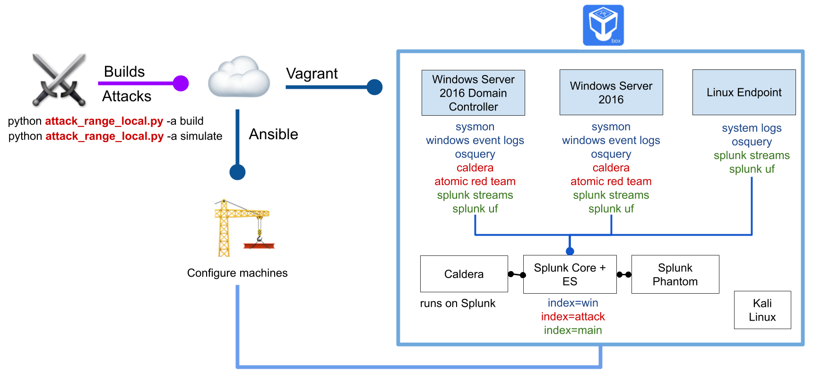

# Splunk Attack Range Local ⚔️

## Purpose 🛡
The Attack Range is a detection development platform, which solves three main challenges in detection engineering. First, the user is able to build quickly a small lab infrastructure as close as possible to a production environment. Second, the Attack Range performs attack simulation using different engines such as Atomic Red Team or Caldera in order to generate real attack data. Third, it integrates seamlessly into any Continuous Integration / Continuous Delivery (CI/CD) pipeline to automate the detection rule testing process.  

## Building 👷‍♂️

Attack Range can be built in three different ways:

- **locally** with vagrant and virtualbox
- **cloud** using terraform and AWS, see [attack\_range](https://github.com/splunk/attack_range)
- **cloud-only** see the [attack\_range\_cloud](https://github.com/splunk/attack_range_cloud/) project for details

## Installation 🏗

### [For Ubuntu 18.04](https://github.com/splunk/attack_range_local/wiki/Ubuntu-18.04-Installation)

### [For MacOS](https://github.com/splunk/attack_range_local/wiki/MacOS-Installation)

## Architecture 🏯


The virtualized deployment of Attack Range consists of:

- Windows Domain Controller
- Windows Server
- Windows Workstation
- A Kali Machine
- Splunk Server
- Phantom Server

Which can be added/removed/configured using [attack_range_local.conf](attack_range_local.conf). More machines such as Phantom, Linux server, Linux client, MacOS clients are currently under development.


#### Logging
The following log sources are collected from the machines:

- Windows Event Logs (```index = win```)
- Sysmon Logs (```index = win```)
- Powershell Logs (```index = win```)
- Network Logs with Splunk Stream (```index = main```)
- Attack Simulation Logs from Atomic Red Team and Caldera (```index = attack```)


## Running 🏃‍♀️
Attack Range supports different actions:

- Build Attack Range
- Perform Attack Simulation
- Destroy Attack Range
- Stop Attack Range
- Resume Attack Range


### Build Attack Range Local
- Build Attack Range Local
```
python attack_range_local.py -a build
```

### Perform Attack Simulation
- Perform Attack Simulation
```
python attack_range_local.py -a simulate -st T1003.001 -t attack-range-windows-domain-controller
```

### Destroy Attack Range Local
- Destroy Attack Range Local
```
python attack_range_local.py -a destroy
```

### Stop Attack Range Local
- Stop Attack Range Local
```
python attack_range_local.py -a stop
```

### Resume Attack Range Local
- Resume Attack Range Local
```
python attack_range_local.py -a resume
```

## Features 💍
- [Splunk Server](https://github.com/splunk/attack_range/wiki/Splunk-Server)
  * Indexing of Microsoft Event Logs, PowerShell Logs, Sysmon Logs, DNS Logs, ...
  * Preconfigured with multiple TAs for field extractions
  * Out of the box Splunk detections with Enterprise Security Content Update ([ESCU](https://splunkbase.splunk.com/app/3449/)) App
  * Preinstalled Machine Learning Toolkit ([MLTK](https://splunkbase.splunk.com/app/2890/))
  * Splunk UI available through port 8000 with user admin
  * ssh connection over configured ssh key

- [Splunk Enterprise Security](https://splunkbase.splunk.com/app/263/)
  * [Splunk Enterprise Security](https://splunkbase.splunk.com/app/263/) is a premium security solution requiring a paid license.
  * Enable or disable [Splunk Enterprise Security](https://splunkbase.splunk.com/app/263/) in [attack_range.conf](attack_range.conf)
  * Purchase a license, download it and store it in the apps folder to use it.

- [Splunk Phantom](https://www.splunk.com/en_us/software/splunk-security-orchestration-and-automation.html)
  * [Splunk Phantom](https://www.splunk.com/en_us/software/splunk-security-orchestration-and-automation.html) is a Security Orchestration and Automation platform
  * For a free development license (100 actions per day) register [here](https://my.phantom.us/login/?next=/)
  * Enable or disable [Splunk Phantom](https://www.splunk.com/en_us/software/splunk-security-orchestration-and-automation.html) in [attack_range.conf](attack_range.conf)

- [Windows Domain Controller & Window Server & Windows 10 Client](https://github.com/splunk/attack_range/wiki/Windows-Infrastructure)
  * Can be enabled, disabled and configured over [attack_range.conf](attack_range.conf)
  * Collecting of Microsoft Event Logs, PowerShell Logs, Sysmon Logs, DNS Logs, ...
  * Sysmon log collection with customizable Sysmon configuration
  * RDP connection over port 3389 with user Administrator

- [Atomic Red Team](https://github.com/redcanaryco/atomic-red-team)
  * Attack Simulation with [Atomic Red Team](https://github.com/redcanaryco/atomic-red-team)
  * Will be automatically installed on target during first execution of simulate
  * Atomic Red Team already uses the new Mitre sub-techniques

- [Caldera](https://github.com/mitre/caldera)
  * Adversary Emulation with [Caldera](https://github.com/mitre/caldera)
  * Installed on the Splunk Server and available over port 8888 with user admin
  * Preinstalled Caldera agents on windows machines

- [Kali Linux](https://www.kali.org/)
  * Preconfigured Kali Linux machine for penetration testing
  * ssh connection over configured ssh key


## Support 📞
Please use the [GitHub issue tracker](https://github.com/splunk/attack_range/issues) to submit bugs or request features.

If you have questions or need support, you can:

* Post a question to [Splunk Answers](http://answers.splunk.com)
* Join the [#security-research](https://splunk-usergroups.slack.com/messages/C1RH09ERM/) room in the [Splunk Slack channel](http://splunk-usergroups.slack.com)
* If you are a Splunk Enterprise customer with a valid support entitlement contract and have a Splunk-related question, you can also open a support case on the https://www.splunk.com/ support portal

## Contributing 🥰
We welcome feedback and contributions from the community! Please see our [contribution guidelines](docs/CONTRIBUTING.md) for more information on how to get involved.

## Author
* [Jose Hernandez](https://twitter.com/d1vious)
* [Patrick Bareiß](https://twitter.com/bareiss_patrick)

## Contributors
* [Bhavin Patel](https://twitter.com/hackpsy)
* [Rod Soto](https://twitter.com/rodsoto)
* Russ Nolen
* Phil Royer
* [Joseph Zadeh](https://twitter.com/JosephZadeh)
* Rico Valdez
* [Dimitris Lambrou](https://twitter.com/etz69)
* [Dave Herrald](https://twitter.com/daveherrald)


## License

Copyright 2020 Splunk Inc.

Licensed under the Apache License, Version 2.0 (the "License");
you may not use this file except in compliance with the License.
You may obtain a copy of the License at

http://www.apache.org/licenses/LICENSE-2.0

Unless required by applicable law or agreed to in writing, software
distributed under the License is distributed on an "AS IS" BASIS,
WITHOUT WARRANTIES OR CONDITIONS OF ANY KIND, either express or implied.
See the License for the specific language governing permissions and
limitations under the License.
